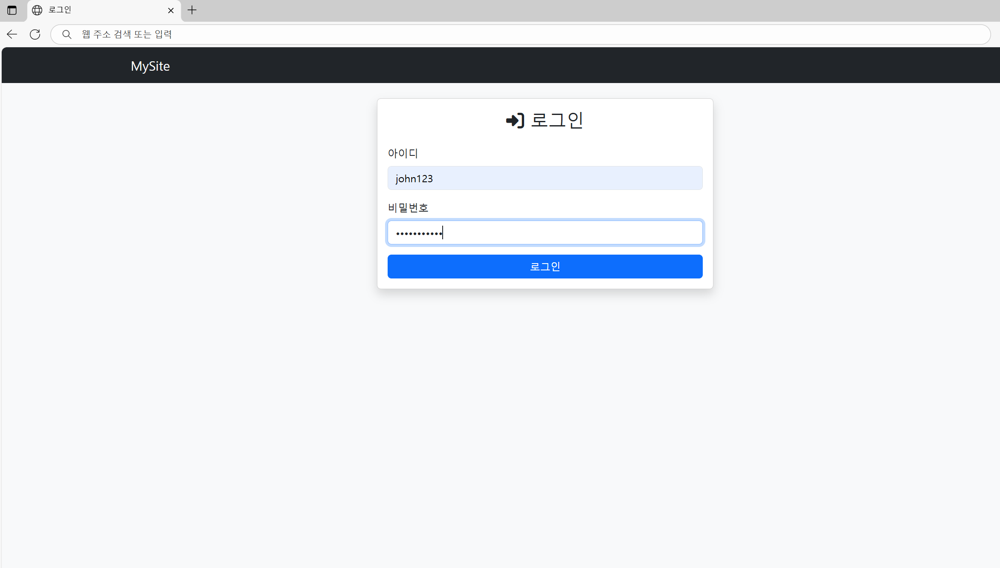
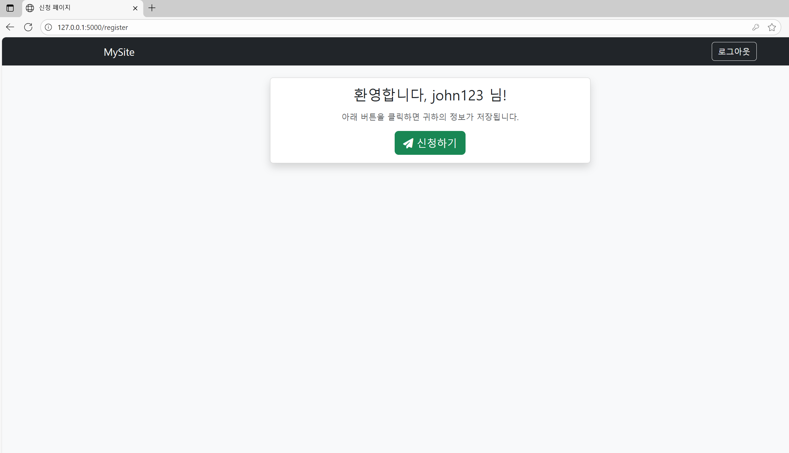
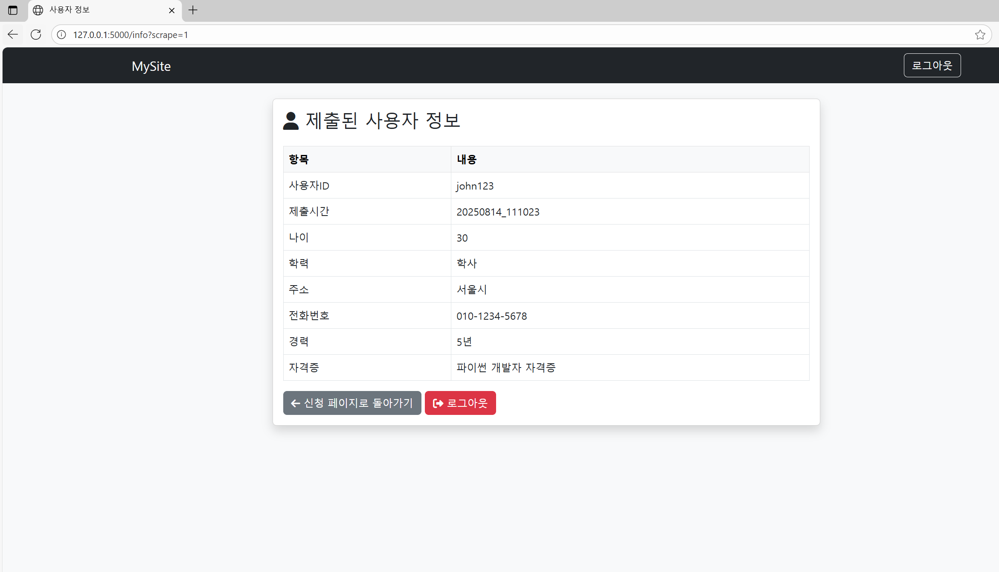

# 📌 Flask 사용자 정보 스크래퍼

로그인, 폼 제출, 스크래핑 기능이 포함된 **Flask 웹 애플리케이션**입니다.  
이 프로젝트는 사용자가 로그인하고, 신청서를 제출하며, 정보가 스크래핑되어 JSON 파일로 저장되는 사용자 포털을 시뮬레이션합니다.  

주요 기능:  
- 자동 로그인 / 자동 제출 기능 (JavaScript 사용)  
- 짧은 시간 후 자동 로그아웃  
- Bootstrap + FontAwesome UI  

---

## 🚀 주요 기능
- 🔑 **사용자 인증**: Flask 세션 기반  
- 📝 **사용자 정보 수집 및 `/info` 페이지 표시**  
- 🕵️ **BeautifulSoup를 이용한 HTML 테이블 스크래핑**  
- 💾 **JSON 파일로 데이터 저장** (개별 + 통합 데이터셋)  
- ⚡ **JavaScript를 이용한 자동 동작**:  
  - 로그인 폼 자동 제출  
  - 5초 후 "신청" 자동 제출  
  - 10초 후 자동 로그아웃  

---

## 🛠️ 기술 스택
- **백엔드**: Flask (Python)  
- **프론트엔드**: Bootstrap 5, FontAwesome, Jinja2 템플릿  
- **스크래핑**: BeautifulSoup4  
- **데이터 저장**: JSON  

---

## 📂 프로젝트 구조
```
project/
│── app_2.py               # 메인 Flask 앱
│── requirements.txt       # Python 패키지 의존성
│── templates/             # HTML 템플릿
│    ├── base.html         # 기본 레이아웃
│    ├── login.html        # 로그인 폼 (자동 제출)
│    ├── register.html     # 신청 페이지 (자동 신청)
│    └── info.html         # 사용자 정보 표시 (자동 로그아웃)
│── scraped/               # 스크래핑된 JSON 파일 자동 생성 폴더
│── diagram_2.png          # 수동 워크플로우 다이어그램
│── diagram_2_auto.png     # 자동 워크플로우 다이어그램
└── README.md              # 문서
```

---

## ⚙️ 설치 및 사용법

1. **레포지토리 클론**
```bash
git clone https://github.com/yourusername/flask-user-scraper.git
cd flask-user-scraper
```

2. **가상환경 생성 및 활성화**

**Windows (PowerShell):**
```powershell
python -m venv venv
.\venv\Scripts\activate
```

**Mac/Linux:**
```bash
python3 -m venv venv
source venv/bin/activate
```

3. **의존성 설치**
```bash
pip install -r requirements.txt
```

4. **앱 실행**
```bash
python app_2.py
```
브라우저에서 👉 `http://127.0.0.1:5000` 접속

---

## 🔑 기본 사용자
| 사용자 ID | 비밀번호       |
|-----------|---------------|
| john123   | password123   |
| anna456   | pass456       |

---

## 📊 워크플로우

| Manual Workflow | Auto Workflow |
|-----------------|---------------|
|  |  |

---

## 🖥️ 애플리케이션 흐름
1. **로그인 페이지 (`/login`)**  
   - 아이디와 비밀번호 입력  
   - 두 필드가 채워지면 자동 제출  

2. **신청 페이지 (`/register`)**  
   - 환영 메시지 표시  
   - 5초 후 "신청" 자동 제출  

3. **정보 페이지 (`/info`)**  
   - 사용자 정보를 테이블로 표시  
   - BeautifulSoup로 스크래핑 후 JSON 저장  
   - 10초 후 자동 로그아웃  

---

## 📊 JSON 출력 예시
- **개별 파일:** `scraped/scraped_user_john123_20250819_102030.json`  
- **통합 파일:** `scraped/all_scraped.json`

```json
{
  "ID": "john123",
  "제출시간": "20250819_102030",
  "나이": 30,
  "학력": "학사",
  "주소": "서울시",
  "전화번호": "010-1234-5678",
  "경력": "5년",
  "자격증": "파이썬 개발자 자격증"
}
```

---
## ▶️ 데모
1. 사용자가 ID와 비밀번호로 (자동) 로그인 <br></br>
   
2. *등록 페이지(Register page)* 표시
3. **신청하기** (5초 후 자동) 클릭 시 *정보 페이지(Info page)* 로 이동하기 <br></br>
   
4. *정보 페이지* 표시
5. (10초 후 자동) **로그아웃** <br></br>
   
---
## 📝 향후 개선 사항
- ✅ 하드코딩된 사용자 대신 회원가입 & 데이터베이스 적용  
- ✅ 비밀번호 해싱 추가로 보안 강화  
- ✅ 스크래핑된 데이터를 SQL/CSV 형식으로 내보내기  
- ✅ Docker를 이용한 배포  
---
# 📌 Flask User Info Scraper

A simple **Flask web application** with login, form submission, and scraping. The project simulates a user portal where users log in, apply, and their information is scraped and stored in JSON files.  

It also demonstrates:  
- Auto-login / auto-submit functionality (using JavaScript)  
- Auto-logout after a short delay  
- Bootstrap + FontAwesome UI  

---

## 🚀 Features
- 🔑 **User authentication** with Flask session  
- 📝 **User info collection** and display on `/info`  
- 🕵️ **BeautifulSoup scraping** of rendered HTML tables  
- 💾 **Save data to JSON** (individual + combined dataset)  
- ⚡ **Auto-actions with JavaScript**:  
  - Auto-submit login form once filled  
  - Auto-submit "apply" after 5 seconds  
  - Auto-logout after 10 seconds  

---

## 🛠️ Tech Stack
- **Backend**: Flask (Python)  
- **Frontend**: Bootstrap 5, FontAwesome, Jinja2 templates  
- **Scraping**: BeautifulSoup4  
- **Storage**: JSON  

---

## 📂 Project Structure
```
project/
│── app_2.py               # Main Flask app
│── requirements.txt       # Python dependencies
│── templates/             # HTML templates
│    ├── base.html         # Base layout
│    ├── login.html        # Login form (auto-submit)
│    ├── register.html     # Application page (auto-apply)
│    └── info.html         # Display user info (auto-logout)
│── scraped/               # Auto-created folder for scraped JSON files
│── diagram_2.png          # Manual workflow diagram
│── diagram_2_auto.png     # Auto workflow diagram
└── README.md              # Documentation
```

---

## ⚙️ Installation & Usage

1. **Clone this repo**
   ```bash
   git clone https://github.com/yourusername/flask-user-scraper.git
   cd flask-user-scraper
   ```

2. **Create & activate virtual environment**

   **Windows (PowerShell):**
   ```powershell
   python -m venv venv
   .\venv\Scripts\activate
   ```

   **Mac/Linux:**
   ```bash
   python3 -m venv venv
   source venv/bin/activate
   ```

3. **Install dependencies**
   ```bash
   pip install -r requirements.txt
   ```

4. **Run the app**
   ```bash
   python app_2.py
   ```
   Visit 👉 `http://127.0.0.1:5000`

---

## 🔑 Default Users
| User ID   | Password     |
|-----------|-------------|
| john123   | password123 |
| anna456   | pass456     |

---

## 📊 Workflow

| Manual Workflow | Auto Workflow |
|-----------------|---------------|
|  |  |

---

## 🖥️ Application Flow
1. **Login Page (`/login`)**  
   - Enter credentials  
   - Auto-submit enabled when both fields are filled  

2. **Register Page (`/register`)**  
   - Shows welcome message  
   - Auto-submits "apply" after 5 seconds  

3. **Info Page (`/info`)**  
   - Displays user info in a table  
   - Scraped by BeautifulSoup and saved as JSON  
   - Auto-logout after 10 seconds  

---

## 📊 Example JSON Output
- **Individual file:** `scraped/scraped_user_john123_20250819_102030.json`  
- **Combined file:** `scraped/all_scraped.json`

```json
{
  "ID": "john123",
  "제출시간": "20250819_102030",
  "나이": 30,
  "학력": "학사",
  "주소": "서울시",
  "전화번호": "010-1234-5678",
  "경력": "5년",
  "자격증": "파이썬 개발자 자격증"
}
```
---
## ▶️ Demo
1. Users **log in** (auto log-in) with their IDs and passwords <br></br>
   
2. *Register page* shows up
3. **신청하기** (auto-click after 5 seconds) to proceed to *Info page* <br></br>
   
4. *Info page* shows up
5. **log out** (auto log-out after 10 seconds) <br></br>
   
---

## 📝 Future Improvements
- ✅ Replace hardcoded users with registration & database  
- ✅ Add password hashing for better security  
- ✅ Export scraped data to SQL/CSV formats  
- ✅ Deploy with Docker  
